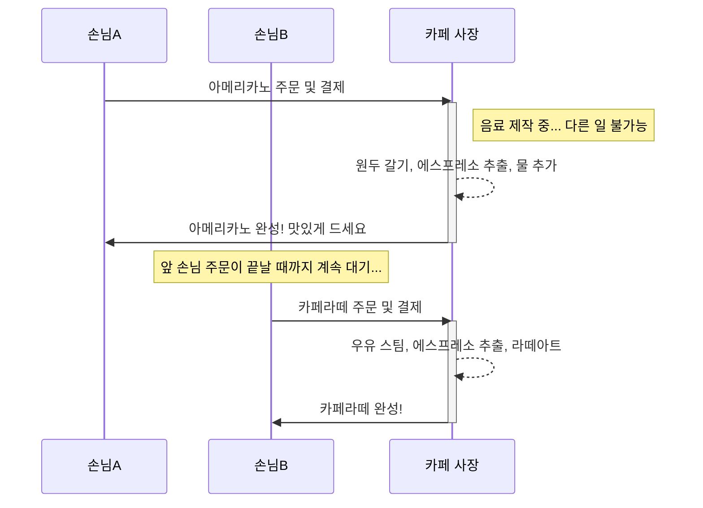
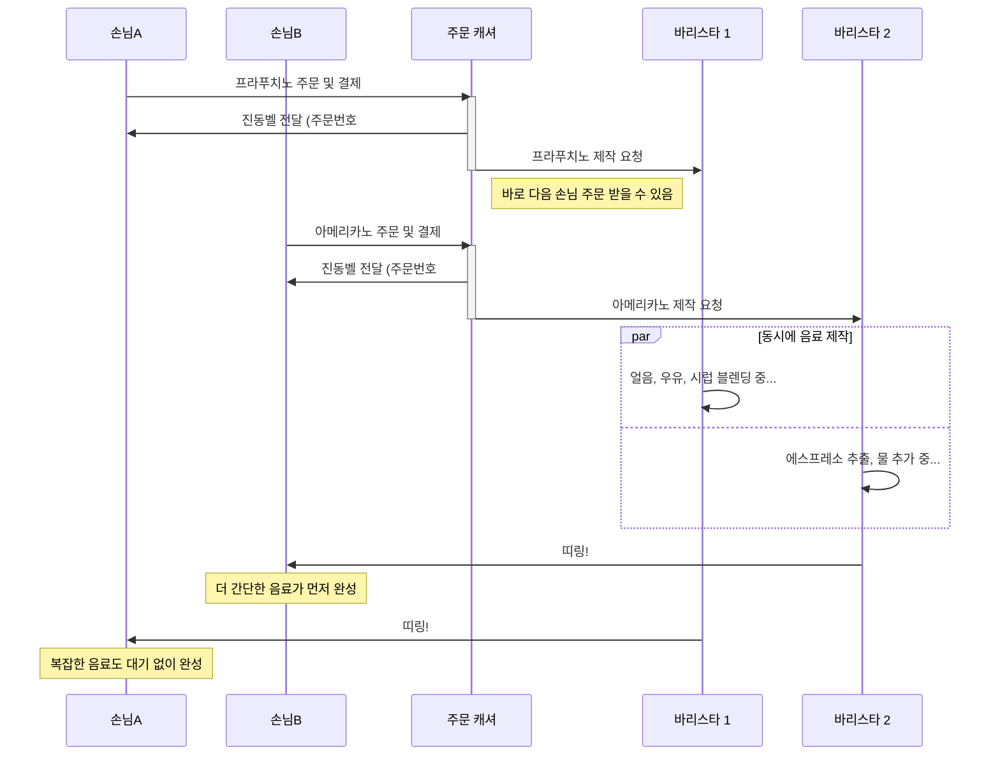

## Node.js란 무엇일까?

많은 개발자가 Node.js를 '백엔드용 JavaScript 프레임워크' 정도로 생각하지만, 이는 절반만 맞는 설명입니다. 정확히 말해 Node.js는 **JavaScript를 브라우저가 아닌 서버 환경에서 실행할 수 있게 해주는 런타임(Runtime)**입니다.

과거 웹 브라우저에 종속되어 있던 JavaScript는 Node.js의 등장으로 서버, 데스크톱 애플리케이션, IoT 등 활동 범위를 폭넓게 확장할 수 있었습니다.

Node.js가 주목받는 가장 큰 이유는 **논블로킹(Non-blocking) I/O**라는 독특한 처리 방식에 있습니다. 이 글에서는 해당 개념을 자세히 파헤쳐 보겠습니다.

## 핵심 개념: 논블로킹 I/O와 스타벅스 비유

논블로킹을 이해하기 위해, 먼저 우리에게 친숙한 '카페 주문' 상황을 통해 블로킹 방식과 비교해 보겠습니다.

### 블로킹(Blocking) 방식: 1인 카페

사장님 혼자 주문을 받고 음료를 만드는 작은 카페를 상상해 봅시다.

1.  손님 A가 커피를 주문합니다.
2.  사장님은 커피 제작에 들어가고, 이 작업이 **완료될 때까지 다음 손님의 주문을 받지 못합니다.**
3.  커피가 완성되어 손님 A에게 전달된 후에야 다음 손님 B의 주문을 받을 수 있습니다.

만약 손님 A의 주문이 복잡하다면, 뒤에 선 모든 손님은 하염없이 기다려야 합니다. 이처럼 하나의 작업이 전체 흐름을 막는 것을 **블로킹**이라고 합니다.

### 논블로킹(Non-blocking) 방식: 스타벅스

이번에는 여러 직원이 협업하는 스타벅스를 예로 들어보겠습니다.

1.  손님 A는 카운터에서 주문 후 **진동벨**을 받습니다.
2.  캐셔는 음료 완성을 기다리지 않고, **즉시 다음 손님 B의 주문을 받습니다.**
3.  음료 제작은 바리스타에게 위임됩니다. (백그라운드 작업)
4.  손님 A의 음료가 완성되면 **진동벨이 울려** 작업 완료를 알립니다.
5.  손님 A는 알림을 받고 음료를 찾아갑니다.

캐셔(메인 스레드)는 시간이 소요되는 음료 제작(I/O 작업)을 바리스타에게 맡기고, 자신은 주문 접수라는 핵심 업무를 멈추지 않습니다. 이것이 바로 Node.js가 동작하는 **논블로킹** 방식입니다.

## 기술적 비교: Node.js vs Python/Java(Spring)

전통적인 백엔드 기술인 Python(Django/Flask)이나 Java(Spring)는 일반적으로 **멀티 스레드** 방식을 사용합니다. 이는 요청마다 별도의 처리 스레드를 할당하는, 즉 손님 한 명당 전담 직원 한 명을 붙여주는 것과 유사합니다.

| 구분 | Node.js (싱글 스레드/이벤트 루프) | Python/Java (멀티 스레드) |
| --- | --- | --- |
| **동작 모델** | **싱글 스레드**, 논블로킹 I/O | **멀티 스레드**, 블로킹 I/O |
| **처리 방식** | 하나의 스레드가 여러 요청을 번갈아 처리 | 요청 하나당 스레드 하나가 전담 처리 |
| **메모리 사용** | 상대적으로 적음 (스레드 생성 비용 절감) | 상대적으로 많음 (요청마다 스레드 생성) |
| **최적 환경** | **I/O 바운드 작업** (잦은 데이터 요청/응답) | **CPU 바운드 작업** (복잡한 연산) |

-   **I/O 바운드(Bound) 작업**: 데이터베이스 조회, 파일 읽기/쓰기, 네트워크 통신 등 작업 자체의 계산량은 적으나 응답 대기 시간이 긴 작업을 의미합니다. Node.js는 이 대기 시간에 다른 요청을 처리하여 높은 효율을 보입니다.
-   **CPU 바운드(Bound) 작업**: 복잡한 연산, 대규모 데이터 처리, 이미지 프로세싱 등 CPU 자원을 많이 소모하는 작업을 의미합니다. 이런 작업은 Node.js의 싱글 스레드를 점유하여 전체 시스템을 느리게 만들 수 있으며, 여러 코어를 활용하는 멀티 스레드 방식이 더 유리합니다.

## Node.js의 한계점

Node.js가 모든 상황에 적합한 만능 해결책은 아닙니다. 다음과 같은 한계점을 명확히 인지해야 합니다.

1.  **CPU 바운드 작업의 비효율성**: 앞서 설명했듯, 단일 스레드 모델의 특성상 무거운 계산 작업은 전체 이벤트 루프를 막아 성능 저하의 주된 원인이 될 수 있습니다.
2.  **콜백 지옥(Callback Hell)**: 비동기 로직 처리를 위해 콜백 함수를 반복적으로 중첩하면 코드의 가독성이 급격히 떨어지고 유지보수가 어려워지는 '콜백 지옥' 현상이 발생할 수 있습니다. (현재는 `Promise`와 `async/await` 문법의 도입으로 대부분 해결되었습니다.)
3.  **에러 처리의 복잡성**: 비동기 코드의 에러는 발생 시점을 특정하기 어렵고, 일반적인 `try-catch` 구문만으로는 모든 예외를 처리하기 까다롭습니다.

## 결론

Node.js는 **가볍고 빠르며, 수많은 동시 연결을 효율적으로 처리해야 하는 I/O 중심의 서비스**를 구축하는 데 매우 강력한 도구입니다. 특히 JavaScript라는 단일 언어로 프론트엔드와 백엔드를 모두 개발할 수 있다는 점은 개발 생산성을 극대화하는 큰 장점입니다.

결론적으로 '최고의 기술'은 존재하지 않으며, '상황에 가장 적합한 기술'이 있을 뿐입니다. 개발하고자 하는 서비스의 특성을 명확히 분석하여 CPU 연산과 I/O 요청의 비중을 고려하고, 그에 맞는 최적의 기술을 선택하는 것이 성공적인 프로젝트의 핵심입니다.
